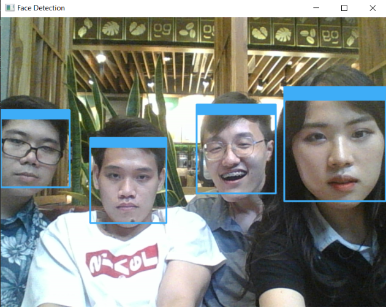

# Face Detection
Face detection using Haar Cascades (frontal face and profile face) and Deep Neural Network (DNN) module in OpenCV.

## Haar Cascade Classifiers
Haar Cascade files can be downloaded from the [OpenCV repository](https://github.com/opencv/opencv/tree/master/data/haarcascades).

## Usage
Usage (using haar cascades): **python face-detect-haar.py [optional.jpg]** 

If only one command line argument is supplied (the program itself e.g. *face-detect-haar.py*), video stream from the webcam will be used as input.
If there are exactly two command line arguments and an image is provided as the second command line argument, the image will be used as input.

## Examples
Running **python face-detect-haar.py**:

